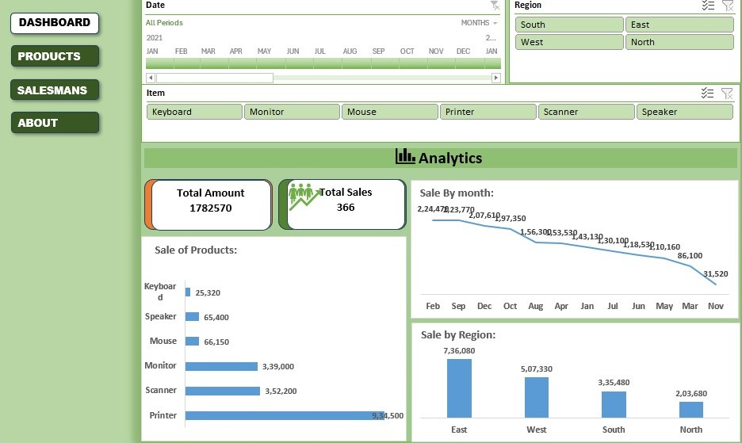

# Sales Analytics Dashboard

## 📊 Project Overview

The dashboard provides a simple view of sales performance by month, product, and region.

## 📌 Key Features

- Total Amount
- Total Sales
- Monthly Sales
- Sales by Product
- Sales by Region
- Product Performance
- Regional Performance

## 🎛️ Interactive Filters

- Date
- Region
- Item

## 🛠️ Tools Used

- Microsoft Excel
- PivotTables
- PivotCharts
- Slicers
- Excel Formulas
- Dashboard Design

## 📷 Dashboard Preview

## 📷 Products

## 📷 Salesmans

## 📁 Project Files

- `project3.xlsx` – Excel dashboard
- `README.md` – Project documentation
- `dash_board.jpg` – Dashboard preview

## 🎯 Project Objective

The objective of this dashboard is to analyze sales performance and provide insights into products, regions, and monthly sales trends for better business decision-making.
